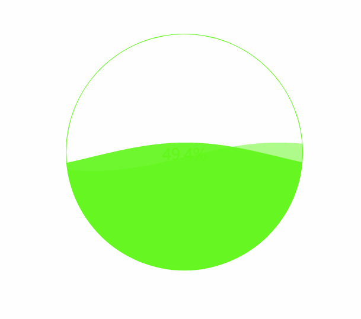

# waveProgress

[](https://travis-ci.com/alanchenchen/waveProgress)


[](https://github.com/996icu/996.ICU/blob/master/LICENSE)

A canvas progress wave with a light plugin system
> Author：Alan Chen

> Version: 0.1.2

> Date: 2019/07/11

> 用canvas绘制波浪进度指示器的插件

## Feature
* 插件内置了很多默认参数，支持开箱即用，最简单的使用方式是只需要传一个参数。
* 兼容PC和移动端页面，因为插件不涉及到外层canvas的宽高，所以适配移动端只跟canvas的宽高有关。
* 提供大量的可配置参数，可以满足常见项目需求。
* 本身只自带波浪效果，但是提供一个轻量的插件系统，支持高度定制。

## Screenshot


## Installation
* `npm install @alanchenchen/waveprogress --save` or `yarn add @alanchenchen/waveprogress`

## Usage
### Constructor
* 构造器传入一个对象，对象的key如下：
    * dom `[String]`，必选，宿主canvas，必须是canvas标签的id或class名称
    * progress `[Number]`，可选，初始的进度，0~100，默认是0
    * waveSpeed `[Number]`，可选，波浪横轴的运动速度，默认为0.05，建议0.01~0.2
    * progressSpeed `[Number]`，可选，波浪纵轴的运动速度，默认为0.6，取值大于0即可
    * waveCharactor `[Object]`，可选，波浪外观配置对象，key值如下：
        * number `[Number]`，可选，波浪的数量，默认是1，只能是1，2，3三者之一
        * color `[String]`，可选，波浪的背景颜色，默认是'24, 133, 249'，只能是rgb颜色字符串
        * waveWidth `[Number]`，可选，波浪宽度,数越小越宽，默认是0.02
        * waveHeight `[Number]`，可选，波浪高度,数越大越高，默认是18
### Instance Methods
1. render `[function(Boolean)]`，渲染数据到画布，初始化实例后，必须调用，参数只有一个：
    * animated `[Boolean]`，可选，是否开启动画，默认为true
2. setProgress `[function(Object) Instance]`，动态改变波浪的纵向高度，即改变进度，一个参数，返回实例本身。参数为一个可选对象，如下：
    * to `[Number]`，可选，结束进度值，默认为当前进度
    * from `[Number]`，可选，开始进度值，默认为当前进度。改变from的值可以重置进度的动画效果
    * animated `[Boolean]`，可选，是否开启动画，默认为true
3. update `[function(Object)]`，更新实例的配置项，返回实例本身。一个参数，参数是一个对象，如下：
    * waveSpeed `[Number]`，可选，波浪横轴的运动速度，同构造器参数
    * progressSpeed `[Number]`，可选，波浪纵轴的运动速度，同构造器参数
    * waveCharactor `[Object]`，可选，波浪外观配置对象，，同构造器参数
4. usePlugin `[function(Object)]`，注册插件，插件会和生命周期钩子结合在一起，返回实例本身。两个参数，参数一是一个对象，参数二是个任意类型，会传给参数一的install函数里，插件结构(参数一)如下：
    * hook `[String]`，生命周期名称，必须是以下一种：
        1. beforeProgress -- 波浪进度开始之前，会在render和setProgress函数调用后立即触发，每调用一次触发一次
        2. beforeProgress:render -- 波浪进度开始之前，只会在render函数调用后立即触发
        3. beforeProgress:setProgress -- 波浪进度开始之前，只会在setProgress函数调用后立即触发
        4. progressing -- 波浪进度发生变化时，只要进度还在变化，就会连续触发，如果想在此钩子内实现canvas动画，不需要写requestAnimationFrame，钩子函数已经集成
        5. afterProgress -- 波浪进度结束时，每调用一次触发一次
        6. update -- 调用实例的update函数后触发，每调用一次触发一次
        7. duringProgress -- 波浪进度的所有过程中和调用update函数都会触发，包含以上所有的生命周期
    * install `[function(Object)]`，插件的执行函数，函数有两个形参
        1. 参数一是个对象，key结构如下：
            * ctx -- 实例的canvas上下文对象，定制额外的canvas效果需要使用
            * configs -- 实例的配置项参数的深拷贝，只读，无法通过修改对象的key值来直接改变实例配置
            * scopedData -- 插件的作用域数据操作对象，主要用于维护对应生命周期的插件内部数据，有两个方法如下：
                * get `[function()]`-- 返回当前插件对应生命周期的存储数据
                * set `[function(any)]` -- 将当前插件对应生命周期的存储数据重写为参数对应的数据

### Plugin
1. 插件使用，模仿vuejs的插件使用方式，并且同一插件多次调用，只会注册一次：
    ```js
    const waveIns = new WaveProgress({
        dom: '#wave'
    })

    // 第二个参数会传递给插件内部，与vuejs的Vue.use()一致
    waveIns.usePlugin(drawText, {
        fontSize: 16
    })
    // 第二次注册同一插件，不会生效，只会注册一次
    waveIns.usePlugin(drawText, {
        fontSize: 16
    })
    ```
2. 当前npm包会内置两个插件，分别是`drawText`(实时显示进度百分比文本)和`drawCircle`(绘制波浪进度指示器的外层圆环)
    * drawText -- 支持传入一个对象，对象结构如下：
        * textAlign，string类型，文本对齐方式，默认是center
        * fontSize，number类型，文本大小，默认是26
        * color，string类型，支持十六进制和rgb写法，文本颜色，默认当进度小于50%时为WaveLoading实例的波浪背景色 ，大于50%时是#fff
    * drawCircle -- 支持传入一个对象，对象结构如下：
        * lineWidth，number类型，边框线条宽度，默认是2
        * lineColor，string类型，支持十六进制和rgb写法，边框线条颜色，默认是WaveLoading实例的波浪背景色
3. 插件开发，模仿vuejs的插件使用方式，增加一个hook：
    ```js
    // 插件必须是一个对象，且必须存在hook和install的key

    // 在每次进度开始前改变波浪背景色为一个随机色的插件
    const randomColor = {
        hook: 'beforeProgress',
        /**
         * 回调函数支持2个参数，参数解释见usePlugin的详细说明
         * 插件为了方便使用，将回调函数中的this指向绑定到了实例本身，也就是说，在install里，可以通过this调用实例的多个方法
         * scopedData主要是为了存储数据，并且还不被别的插件互相干扰，对于某些情况非常有用
         * 为了让插件和实例尽可能解耦，在开发插件时，可以通过this访问实例本身，可以通过configs读取实例属性，可以通过scopedData来存储或重写插件本身需要的数据，这样让插件更加具有可玩性！
         */
        install({ctx, configs, scopedData}, opts={}) {
            const random = () => Math.random()*255 + 1
            scopedData.set({
                color: `${random()}, ${random()}, ${random()}`
            })
            this.update({
                waveCharactor: {
                    color: `${random()}, ${random()}, ${random()}`
                }
            })
        }
    }
    ```
## Example
* [实例例子](./example/wave.html)
* [插件例子](./src/plugins/drawText.js)

## Attention
1. 实例方法除了render以外，都支持链式调用。
2. 实例调用update方法后，会直接生效，不会干扰progress过程。
3. 实例的configs对象无法添加和删除属性，只允许修改，否则会报错，已经做了seal处理，但是不建议直接修改configs，建议通过update方法，因为会触发钩子函数。
4. 开发插件时，回调函数的this指向实例本身，并且参数一的configs只读。
5. 实例如果不使用任何插件，只具有波浪效果。
6. 给波浪添加外层形状其实非常简单，可以直接改变canvas标签的css，也可以使用类似drawCircle的插件。

## license
* Anti 996(996.ICU)